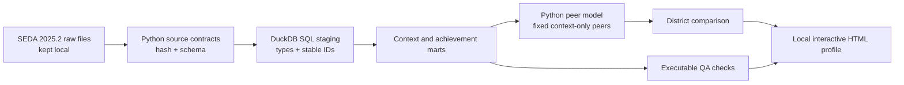

# District Learning Context Explorer

I built this project around a practical education question:

> How do a district's math and reading estimates compare with districts that are similar on selected public context measures, and how has that pattern changed over time?

The first view focuses on grade 4 because that is where the question became personally meaningful to me as the parent of a fourth-grade daughter. The analytical design covers grades 3 through 8, and the selected district can be changed. The project uses public district-level data and contains no information about my daughter or any individual student.

**[Open the Simple District Trends report](https://nilkamal11.github.io/district-learning-context-explorer/?trend_district=1728890&trend_grade=4&trend_subject=mth#trends)** to begin with North Palos School District 117, grade 4 math. The [full dashboard](https://nilkamal11.github.io/district-learning-context-explorer/) also has a grade 4 comparison page, a detailed SEDA workbench, a [study-design example](https://nilkamal11.github.io/district-learning-context-explorer/#research), and technical details.

## What it does

- Loads the SEDA files into DuckDB and reshapes them into district-year results with SQL.
- Uses Python to calculate the optional similar-district comparison and build the published site.
- Shows one grade and subject at a time, keeps missing years blank, and displays uncertainty where available.
- Includes a worked plan for joining public finance and enrollment data to a follow-up research question.

Similar districts are selected using 2024 community context. Test scores are excluded from the matching calculation.

## Design at a glance



DuckDB keeps the demonstration fast and free to reproduce locally. The layered SQL models avoid database-specific procedural code, so the same pattern can move to PostgreSQL, Snowflake, Redshift, or another analytical warehouse.

## Data

Version 0.1 uses three files from the [Stanford Education Data Archive 2025.2 release](https://edopportunity.org/trends/data/downloads/):

1. Administrative district achievement estimates on the Cohort Standardized (CS) scale, long by grade, subject, and year
2. Annual administrative district covariates, with 2024 frozen as the peer-context snapshot
3. The SEDA administrative district identifier crosswalk, used to audit ID changes and resolve external year-specific IDs to the already-stable `sedaadmin` identifier used in the analytical files

The achievement file covers spring 2009 through 2019 and 2022 through 2025. There are no yearly grade-specific estimates for 2020 or 2021, so the report shows a visible break instead of drawing a continuous line across those years.

Source files are governed by Stanford's [Data Use Agreement](https://edopportunity.org/trends/data/). Stanford confirmed to the project owner that this Git portfolio use is permitted. The repository publishes selected derived columns for the all-student, administrative-district CS estimates used by the grade 3–8 browser workbench; it does not include the raw source files, local DuckDB database, or unrestricted working outputs. That confirmation applies to this project owner's use and does not grant downstream users independent rights to Stanford data.

## Dashboard pages

**Simple District Trends** shows one district, grade, and subject by year. It starts with North Palos School District 117 and fourth-grade math, shows the latest result, and calculates changes from spring 2019 and spring 2022. Missing years stay blank.

The **Explore** page compares one fourth-grade district with places serving similar communities. Test scores are excluded from the matching calculation.

The **SEDA 2025.2 District Data Workbench** lets you compare up to four districts across grades 3–8 and download the selected records. It also keeps missing results and uncertainty visible.

The **Study Design** page lays out a follow-up question: whether changes in instructional spending per student are followed by changes in fourth-grade math. It shows how SEDA could be joined to public finance and enrollment data, how district IDs and years would be checked, and what would be delivered to the researcher. It does not report a finding.

Stanford’s [Education Opportunity Trends Explorer](https://edopportunity.org/trends/explorer/) is the place to use for national maps and broad comparisons. This project focuses on annual results for a selected district, grade, and subject, with uncertainty, missing years, and test counts available in the Workbench.

## Quick start

Python 3.11 or newer is required.

```powershell
py -3.12 -m venv .venv
.\.venv\Scripts\Activate.ps1
python -m pip install -e ".[dev]"

district-context sources
district-context verify
district-context build
district-context qa
district-context find "district name"
district-context resolve --source-id 0123456 --year 2024
district-context profile --district-id 0123456 --grade 4
district-context dashboard --district-id 1700044 --grade 4
```

The administrative crosswalk in this release covers 2022 through 2025, so `resolve` does not imply historical source-ID coverage for 2009 through 2019.

For a neutral smoke test, the demo command chooses the eligible district nearest the state's median grades 3–8 enrollment. It does not choose a district based on achievement.

```powershell
district-context demo --state IL --grade 4
```

Local outputs are written to `data/output/` and are ignored by Git. The single-profile HTML embeds its chart library once so it works without an internet connection. The `dashboard` command builds the public static site, a small catalog-and-context file, grade 4 state files for the opening views, and separate grade 3–8 files for the national workbench. The browser loads the detailed records only when a view needs them, then performs deterministic matching and uncertainty calculations. Run both publication guards before every commit:

```powershell
python scripts/check_no_restricted_data.py
python scripts/check_public_dashboard.py
```

The supported setup is a cloned repository with the editable install shown above. A standalone wheel is not currently a supported execution mode because the versioned SQL and configuration live at the repository root.

## Peer definition

The primary reference is up to 15 same-state districts. Matching uses four equally weighted domains:

| Domain | Inputs |
|---|---|
| District scale | Log enrollment in grades 3–8 |
| Economic context | Family poverty rate and SEDA socioeconomic status composite |
| Student composition | Race and ethnicity share vector |
| Place | City, suburb, town, and rural share vector |

The inputs are put on comparable scales before the four equally weighted factor scores are averaged. Matching begins with districts that have a similar grade range and locale, enrollment within a factor of four, and poverty within 15 percentage points. If fewer than ten in-state candidates remain, the search expands and the report records which rule changed. A separate nationwide comparison excludes the target state and limits the number of districts from any one state. The full calculation is documented in [`docs/methodology.md`](docs/methodology.md).

The SEDA annual file's recent English learner and special education fields are constant at zero across districts. Version 0.1 excludes them from matching and tests the included fields for variation.

I used equal weights because I did not have a defensible reason to favor one category. I have not yet tested how much the selected comparison groups change under alternative weights; that is the first sensitivity check I would add.

See [methodology.md](docs/methodology.md) for the full specification.

## Interpretation notes

- Math and reading stay separate, and CS values are compared only within the same grade and subject.
- Each year contains a different group of tested students. The chart does not measure growth for the same children.
- Missing and suppressed values remain blank.
- Same-state and nationwide comparisons use different standard-error fields supplied by SEDA. Nationwide comparisons remain descriptive.
- A higher-or-lower label requires at least 10 reporting comparison districts and 70% coverage. These are descriptive estimates, not causal results.

## Repository map

```text
config/                    Versioned source and model specifications
sql/models/                Ordered SQL staging, dimension, and mart models
src/district_context/      Pipeline, matching, QA, CLI, and reporting code
tests/                     Test-only software fixtures and contract tests
docs/                      Research specification, methods, lineage, and limits
reports/                   Public documentation and QA catalog, never raw rows
site/                      GitHub Pages dashboard and approved derived bundle
data/raw/                  Local source files, ignored by Git
data/processed/            Local DuckDB database, ignored by Git
data/output/               Local reports and manifests, ignored by Git
```

## Citation

Reardon, S. F., Fahle, E. M., Ho, A. D., Shear, B. R., Saliba, J., Min, J., Shim, J., & Kalogrides, D. (2026). *Stanford Education Data Archive (Version SEDA 2025.2).* https://doi.org/10.25740/np279jm6134

The code is MIT licensed. Third-party data and documentation are excluded from that license. This project is independent and is not endorsed by Stanford, HMH, or NWEA.
