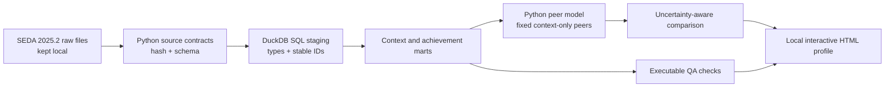

# District Learning Context Explorer

A reproducible, uncertainty-aware way to ask a practical education question:

> How do a district's math and reading estimates compare with districts that are similar on selected public context measures, and how has that pattern changed over time?

The first view focuses on grade 4 because that is where the question became personally meaningful to me as the parent of a fourth-grade daughter. The analytical design covers grades 3 through 8 and keeps the selected district configurable. No family, child, school, or home-district information is stored in the repository.

**[Open the Simple District Trends report](https://nilkamal11.github.io/district-learning-context-explorer/?trend_district=1728890&trend_grade=4&trend_subject=mth#trends)** to begin with North Palos School District 117, grade 4 math. The [full interactive dashboard](https://nilkamal11.github.io/district-learning-context-explorer/) also includes the original grade-4 peer profile, the detailed SEDA workbench, a [worked cross-source research extension](https://nilkamal11.github.io/district-learning-context-explorer/#research), and the technical process.

## What this project demonstrates

- Python orchestration, feature engineering, peer selection, uncertainty calculations, and report generation
- SQL staging, type normalization, dimensional modeling, analytical marts, and quality-control queries
- Large-file ingestion from a 1.03 GB district achievement file
- Stable identifier handling, including seven-character IDs, crosswalk audits, and source-to-stable ID resolution
- Reproducible source manifests, SHA-256 checks, deterministic peer selection, and Git-based CI
- Clear translation from statistical estimates to a district and parent-facing explanation
- A chart-first, one-district view with plain-language changes from exact earlier years
- A cross-source research specification that connects SEDA to public finance, staffing, enrollment, and inflation data without inventing findings
- Responsible handling of suppression, missingness, measurement error, and limits on causal inference
- Lazy browser loading of six grade slices, multi-district comparison, URL state, and filtered CSV export

The project is intentionally not a district ranking. Peers are selected from community context only. Achievement never enters the matching algorithm.

## Design at a glance



DuckDB keeps the demonstration fast and free to reproduce locally. The layered SQL models avoid database-specific procedural code, so the same pattern can move to PostgreSQL, Snowflake, Redshift, or another analytical warehouse.

## Data

Version 0.1 uses three files from the [Stanford Education Data Archive 2025.2 release](https://edopportunity.org/trends/data/downloads/):

1. Administrative district achievement estimates on the Cohort Standardized (CS) scale, long by grade, subject, and year
2. Annual administrative district covariates, with 2024 frozen as the peer-context snapshot
3. The SEDA administrative district identifier crosswalk, used to audit ID changes and resolve external year-specific IDs to the already-stable `sedaadmin` identifier used in the analytical files

The achievement file covers spring 2009 through 2019 and 2022 through 2025. There are no yearly grade-specific estimates for 2020 or 2021, so the report shows a visible break instead of drawing a continuous line across those years.

Source files are governed by Stanford's [Data Use Agreement](https://edopportunity.org/trends/data/). Stanford confirmed to the project owner that this Git portfolio use is permitted. The repository publishes selected derived columns for the all-student, administrative-district CS estimates used by the grade 3–8 browser workbench; it does not include the raw source files, local DuckDB database, or unrestricted working outputs. That confirmation applies to this project owner's use and does not grant downstream users independent rights to Stanford data.

## Four analytical views

**Simple District Trends** asks the easiest question first: how did one district's result change over time for one grade and subject? It starts with North Palos School District 117, shows the latest released result, calculates exact changes from spring 2019 and spring 2022, and keeps missing 2020, 2021, or later results visibly missing. It does not use peers or rankings.

The original **district profile** asks a separate question about one fourth-grade district and context-matched peers. The **SEDA 2025.2 District Data Workbench** exposes the more detailed yearly grade-specific evidence behind both summaries:

- Grades 3–8, mathematics and reading, and the 15 released years from 2009–2019 and 2022–2025
- Up to four administrative districts in one view, including districts with missing grade-subject-year estimates
- Automatic within-state or adjusted cross-state uncertainty intervals
- A state or national distribution without rankings
- A coverage and precision matrix, long-form estimate table, persistent share link, and current-view CSV export

The **Research Extensions** page demonstrates the next layer of analyst support without presenting a result that has not been calculated. Its worked brief asks whether district changes in instructional spending per student are associated with later changes in fourth-grade math. It specifies a 2022–2024 join among SEDA, Census school-finance records, NCES enrollment and staffing records, and BLS inflation data; makes district identity and timing explicit; and defines the researcher handoff, join audits, sensitivity checks, and causal boundary. Two additional briefs show how the same discipline could support governed product-use research or investigate whether an apparent trend reflects district restructuring or changing coverage.

Stanford already offers the official [Education Opportunity Trends Explorer](https://edopportunity.org/trends/explorer/) for national map and chart views, subgroup gaps, similar places, and four modeled 2022–2025 score and learning-rate summaries. This project does not attempt to replace it. Stanford's tool is the stronger national discovery experience. This project's simpler report opens one district's released annual grade-subject estimates from 2009 forward, while the workbench exposes the yearly uncertainty, missingness, and test counts. The scope remains intentionally narrow: administrative districts, all students, and the Cohort Standardized scale.

## Quick start

Python 3.11 or newer is required.

```powershell
py -3.12 -m venv .venv
.\.venv\Scripts\Activate.ps1
python -m pip install -e ".[dev]"

district-context sources
district-context verify
district-context build
district-context qa
district-context find "district name"
district-context resolve --source-id 0123456 --year 2024
district-context profile --district-id 0123456 --grade 4
district-context dashboard --district-id 1700044 --grade 4
```

The administrative crosswalk in this release covers 2022 through 2025, so `resolve` does not imply historical source-ID coverage for 2009 through 2019.

For a neutral smoke test, the demo command chooses the eligible district nearest the state's median grades 3–8 enrollment. It does not choose a district based on achievement.

```powershell
district-context demo --state IL --grade 4
```

Local outputs are written to `data/output/` and are ignored by Git. The single-profile HTML embeds its chart library once so it works without an internet connection. The `dashboard` command builds the public static site, its initial grade-4 slice, and lazy grade slices for grades 3 and 5–8. The browser performs deterministic matching and uncertainty calculations when a district is selected. Run both publication guards before every commit:

```powershell
python scripts/check_no_restricted_data.py
python scripts/check_public_dashboard.py
```

The supported setup is a cloned repository with the editable install shown above. A standalone wheel is not currently a supported execution mode because the versioned SQL and configuration live at the repository root.

## Peer definition

The primary reference is up to 15 same-state districts. Matching uses four equally weighted domains:

| Domain | Inputs |
|---|---|
| District scale | Log enrollment in grades 3–8 |
| Economic context | Family poverty rate and SEDA socioeconomic status composite |
| Student composition | Race and ethnicity share vector |
| Place | City, suburb, town, and rural share vector |

Numeric differences use robust 5th-to-95th percentile ranges. Composition vectors use Hellinger distance. Matching begins with the same grade-span and locale category, enrollment within a factor of four, and poverty within 15 percentage points. If fewer than ten in-state candidates remain, the relaxation is recorded rather than hidden. A separate national analog panel excludes the target state, uses cross-state adjusted standard errors, and caps the number of peers from any one state. The report exposes domain-level distances rather than calling a peer set “strong” based on count alone.

The SEDA annual file's recent English learner and special education fields are constant at zero across districts, so version 0.1 excludes them from matching and tests match features for real variation. Treating a populated field as informative without checking its distribution would create false sophistication.

See [methodology.md](docs/methodology.md) for the full specification.

## Interpretation rules

- Math and reading are always separate.
- CS values are comparable across places and years only within a fixed grade and subject.
- Yearly grade-specific results are repeated district cross-sections, not growth for the same students.
- Missing and suppressed values never become zero.
- Same-state comparisons use SEDA's unadjusted standard error. Cross-state comparisons use its adjusted standard error.
- A comparison requires at least 10 reporting peers and at least 70% coverage of the selected set in that year and subject.
- National analog comparisons remain descriptive because state-level linking errors may be correlated.
- The report says “higher,” “lower,” or “not clearly different,” not “better,” “worse,” or “top ranked.”
- Results are associations and descriptive comparisons, not causal estimates.

## Repository map

```text
config/                    Versioned source and model specifications
sql/models/                Ordered SQL staging, dimension, and mart models
src/district_context/      Pipeline, matching, QA, CLI, and reporting code
tests/                     Test-only software fixtures and contract tests
docs/                      Research specification, methods, lineage, and limits
reports/                   Public documentation and QA catalog, never raw rows
site/                      GitHub Pages dashboard and approved derived bundle
data/raw/                  Local source files, ignored by Git
data/processed/            Local DuckDB database, ignored by Git
data/output/               Local reports and manifests, ignored by Git
```

## Role-relevant evidence

| Work in the role | Evidence here |
|---|---|
| Work with large assessment data | Grade-by-district-by-subject-by-year SEDA fact table |
| Extract, clean, and link data | Python source contracts, SQL staging, crosswalk audit mart and ID resolver |
| Build reproducible pipelines | One CLI, versioned model config, source hashes, ordered models, build manifest |
| Validate and troubleshoot | Grain tests, range checks, suppression rules, QA result table |
| Support research specifications | Versioned peer algorithm, a worked cross-source study design, and explicit interpretation rules |
| Communicate to varied audiences | Interactive profile plus plain-language evidence limits |
| Use SQL and Python together | DuckDB transformations plus Python analytics and rendering |
| Collaborate in Git | Small modules, automated tests, linting, and restricted-data guard |

Product-event analysis is not claimed in version 0.1. The Research Extensions page shows how governed product events, licenses, rosters, implementation milestones, and outcomes would be specified and audited, while clearly stating that no internal product data or efficacy finding is present in this public portfolio.

## Citation

Reardon, S. F., Fahle, E. M., Ho, A. D., Shear, B. R., Saliba, J., Min, J., Shim, J., & Kalogrides, D. (2026). *Stanford Education Data Archive (Version SEDA 2025.2).* https://doi.org/10.25740/np279jm6134

The code is MIT licensed. Third-party data and documentation are excluded from that license. This project is independent and is not endorsed by Stanford, HMH, or NWEA.
